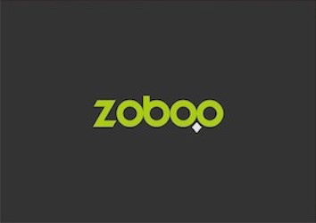

# Zoboo

  

 
 
## :heavy_check_mark: Kullanılan Teknolojiler : 

## :heavy_check_mark: Projenin Amacı :

Kullanıcıların ingilizce kelimeleri kalıcı olarak ezberlemesin kolaylaştırılması, basit arayüzü ile kullanımı kolay ve grafiksel ezberlenen kelime sayılarının takip edilmesi hedeflenmiştir.

## :heavy_check_mark: Projenin Çalışma Mantığı :

 Kullanıcı ezberlemek istediği kelimeyi sisteme ekler ve sistem belirli aralıklarla(1 gün, 1 hafta, 1 ay, 6 ay) eklenilen kelimelerden sınava tabi tutar. Kullanıcı her sınavın sonucunu doğru bildiğinde bir sonraki aşamaya geçer ve yeni sınav gününü bekler. Kullanıcın sisteme düzenli olarak girmesi gerekmektedir. Sınav tarihini kaçırdığı takdirde sınav sonucu yanlış kabul edilecek ve sorgu döngüsü en baştan başlayacaktır.

##  :heavy_check_mark: PROJE EKİBİ :  

[Berkan ŞAŞMAZ](https://github.com/berkansasmaz)

[Mustafa Taha SOYDAN](https://github.com/Mtsoydan)

TODO:  
- [x] İstatistik ekranı ekle
- [ ] User Register/Auth ekle
- [ ] Database-Level Roles

 
